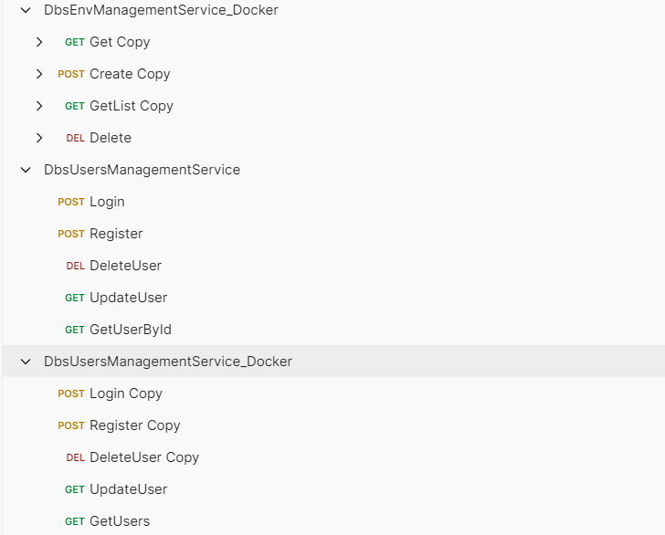

# Overview
| *This project is the presentation project for the FPT Software Internship period

Deployment Booking System: A mock booking system for booking source code deployment time range supporting multiples group to work on a same AWS environment without encountering conflicts. Users can book a time range they want to deploy their code, efficently manage shared resources.

| This project for now just presents the backend microservices size of the booking system

**With noticable uses of:**

* Token validation
* Fluent Validation: split validations into multiple files for scaling and easy management
* Custom Authorization: using policy for authorization
* Middleware Error Exception: a full functional system to catch error and return easy-to-read errors 

## Requirements
We have the overall and simple architecture of the project

And requirements for each endpoints/services look like:

## Endpoints example
All Endpoints for local run and docker run

Example of some endpoint calls and returns

# Tech Stack
Backend:
* .NET Core API 
* Microservices architecture
Docker:
* Containerizing all the services and the BFF

# Installation 
1. Clone the repo
2. Open project in Visual Studio
3. Install all dependencies / Nugget packages required
4. Check namespace, utils and any error,...
5. Run the project

